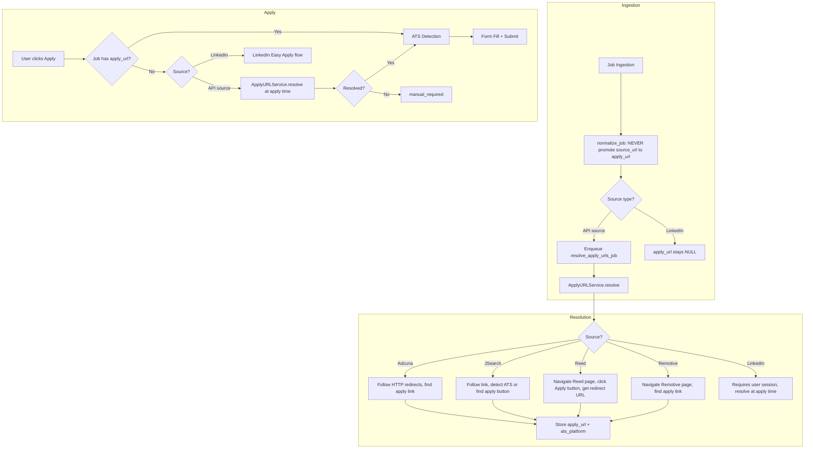

# Unified Apply URL Resolution Service

**Date:** 2026-05-12
**Status:** Approved
**Supersedes:** 2026-05-11-auto-apply-url-resolution-design.md
**Approach:** Unified URL Resolution Service with source-specific strategies (Approach C)

## Problem

ALL 5 job sources provide listing URLs, not direct apply URLs. The current code masks this by copying `source_url` into `apply_url` in `normalize_job`, making the system think it has an apply form when it actually has a job listing page. This causes every auto-apply attempt to fail with "Manual application required."

| Source | `source_url` value | Actual destination |
|--------|-------------------|-------------------|
| Adzuna | `redirect_url` (tracker) | Redirects through Adzuna to employer job listing |
| JSearch | `job_apply_link` or `job_google_link` | Sometimes direct ATS, sometimes Google interstitial |
| Reed | `jobUrl` | Reed listing page with "Apply" button |
| Remotive | `url` | Remotive listing page with apply button |
| LinkedIn | LinkedIn `/jobs/view/ID` URL | Requires LinkedIn auth to view |

## Solution: Unified ApplyURLService

A new service that sits between ingestion and apply, with source-specific resolution strategies.

### Architecture



### Resolution Timing: Hybrid

- **API sources** (Adzuna, JSearch, Reed, Remotive): Resolve at ingestion time as background job. Zero delay when user clicks Apply.
- **LinkedIn**: Resolve at apply time. Requires user's LinkedIn session credentials, cannot pre-resolve.

### Source-Specific Strategies

#### Adzuna Strategy
1. HTTP GET to `source_url` (redirect_url) with httpx, follow redirects (no browser)
2. If final URL matches ATS pattern (Greenhouse, Lever, Workday), store as `apply_url`
3. If final URL is a job listing page, use Playwright to find apply link
4. If nothing found, `apply_url` stays NULL, falls back to web search at apply time

#### JSearch Strategy
1. Check if `source_url` (`job_apply_link`) is already a direct ATS URL
2. If yes, store directly
3. If `job_google_link`, follow HTTP redirects, then Playwright for apply link
4. JSearch sometimes provides real apply URLs, so check first before resolving

#### Reed Strategy
1. HTTP GET to `source_url` (Reed listing page)
2. Parse HTML for the apply button URL (Reed has a known redirect pattern)
3. Follow the Reed apply redirect to get the employer's actual apply page
4. Store the final URL as `apply_url`

#### Remotive Strategy
1. HTTP GET to `source_url` (Remotive listing page)
2. Parse HTML for apply button/link
3. Follow to employer's apply page
4. Store as `apply_url`

#### LinkedIn Strategy (apply-time only)
1. Check if user has LinkedIn credentials stored
2. If yes, use `LinkedInDiscovery` to login and navigate to the job
3. Check for "Easy Apply" button
4. If Easy Apply: fill name, email, phone, upload resume, submit
5. If external "Apply" button: follow redirect, use generic form detector
6. If neither: manual_required

## Components

### 1. ApplyURLService (new)

```python
class ApplyURLService:
    """Unified URL resolution with source-specific strategies."""

    def __init__(self, browser_service: BrowserService):
        self._browser = browser_service
        self._strategies = {
            JobSource.adzuna: self._resolve_adzuna,
            JobSource.jsearch: self._resolve_jsearch,
            JobSource.reed: self._resolve_reed,
            JobSource.remotive: self._resolve_remotive,
        }

    async def resolve(self, job: Job) -> URLResolution:
        """Resolve apply URL using source-specific strategy."""
        strategy = self._strategies.get(job.source)
        if strategy:
            return await strategy(job)
        return await self._resolve_generic(job)

    async def _resolve_adzuna(self, job: Job) -> URLResolution: ...
    async def _resolve_jsearch(self, job: Job) -> URLResolution: ...
    async def _resolve_reed(self, job: Job) -> URLResolution: ...
    async def _resolve_remotive(self, job: Job) -> URLResolution: ...
    async def _resolve_generic(self, job: Job) -> URLResolution: ...
```

### 2. LinkedInAutoApply (new)

```python
class LinkedInAutoApply:
    """Handle LinkedIn Easy Apply and external redirect apply."""

    async def try_easy_apply(self, page, profile, resume_path) -> ApplyResult: ...
    async def try_external_apply(self, page, profile, resume_path) -> ApplyResult: ...
    async def apply(self, job, profile, resume_path) -> ApplyResult: ...
```

### 3. Fix normalize_job

Stop promoting `source_url` to `apply_url` in `job_discovery.py`.

### 4. Fix ats_detect_job worker

Use `ApplyURLService` instead of raw `URLResolver`. Handle LinkedIn source specially.

### 5. Fix apply_orchestrator

Handle LinkedIn-sourced jobs by routing to `LinkedInAutoApply` instead of the ATS filler path.

### 6. resolve_apply_urls_job (new worker)

Background job that resolves `apply_url` for recently ingested API-source jobs.

## Status Flow

```
saved -> generating -> ready -> applying -> applied
                                       -> applied_with_issues
                                       -> manual_required (with instructions)
                                       -> failed
```

No new statuses. Existing flow handles everything.

## Error Handling

| Scenario | Resolution |
|----------|------------|
| Aggregator redirect chain dead (404) | Fall back to web search |
| Aggregator redirect hits login wall | Mark manual_required with listing URL |
| Reed apply button requires JS | Use Playwright instead of httpx |
| LinkedIn CAPTCHA on login | Set manual_required, notify user |
| LinkedIn job requires external apply | Follow redirect to employer site, use generic form detector |
| LinkedIn Easy Apply has extra fields | Fill what we can, set applied_with_issues |
| No apply link found on listing page | Fall back to web search, then manual_required |
| Web search finds no results | manual_required with source_url |

## Files to Create/Modify

| File | Action | Purpose |
|------|--------|---------|
| `backend/app/services/apply_url_service.py` | Create | Unified URL resolution service |
| `backend/app/services/linkedin_auto_apply.py` | Create | LinkedIn Easy Apply + external redirect handler |
| `backend/app/services/job_discovery.py` | Modify | Stop promoting source_url to apply_url |
| `backend/app/services/url_resolver.py` | Modify | Add HTTP redirect following, improve apply link detection |
| `backend/app/workers/job_worker.py` | Modify | Use ApplyURLService in ats_detect_job, add resolve_apply_urls_job |
| `backend/app/services/apply_orchestrator.py` | Modify | Route LinkedIn jobs to LinkedInAutoApply |
| `backend/app/config.py` | Modify | Add resolution config settings |
| `backend/tests/test_apply_orchestrator.py` | Modify | Update for new behavior |
| `backend/tests/test_apply_auto_routes.py` | Modify | Update for new behavior |
| `backend/tests/test_apply_url_service.py` | Create | Tests for new service |
| `backend/tests/test_linkedin_auto_apply.py` | Create | Tests for LinkedIn handler |

## Scope

**In scope:**
- Unified ApplyURLService with source-specific strategies for all 5 sources
- LinkedIn Easy Apply automation
- LinkedIn external apply redirect handling
- Fix ingestion to stop promoting source_url to apply_url
- Background URL resolution at ingestion time for API sources
- Apply-time URL resolution for LinkedIn

**Out of scope:**
- Adding more platform-specific ATS fillers (Taleo, iCIMS, etc.)
- CAPTCHA solving
- Bulk apply changes (works automatically)
- Frontend changes (existing UI handles manual_required)
